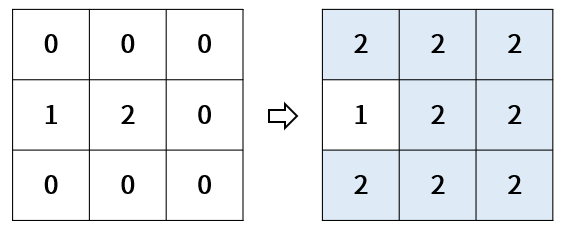

Practice
===

문제 설명
---

도로의 특정 지점에서 물이 새고 있다.  
도로를 2차원 배열로 구역을 나누고 다음과 같이 0, 1, 2로 정보를 표시하였다.  
* 0은 정상 도로
* 1은 벽으로 막아둔 곳
* 2는 물이 새고 있는 지점

예를 들어, 도로 상태가 아래 좌측과 같은 경우,  
시간이 지나면 오른쪽과 같이 물이 퍼지게 된다.

이 때 벽을 정상 도로 위의 3 곳에 설치할 수 있는데,  
아래와 같이 설치한 경우는 물이 퍼지지 않게 되고,
이 때 정상 도로는 네 군대가 남게 된다.

 

이와 같이 도로 상태가 주어졌을 때 벽을 세 군데 설치한 후,  
물이 퍼지지 않은 정상 도로의 개수가 최대가 되는 값을 구하는 프로그램을 작성하세요.

입력 형식
---

도로 정보는 roads 2차원 배열로 주어지며,  
행과 열의 크기가 각각 3 이상 10 이하의 자연수이다.

도로 정보 내에 물이 새는 지점의 수는 1 이상 5 이하의 자연수로 주어진다.

출력 형식
---

물이 퍼지지 않은 정상 도로의 최대 개수를 반환하세요.

입출력 예시
---
| roads                             | Result |
|-----------------------------------|--------|
| {{0, 0, 0}, {1, 2, 0}, {0, 0, 0}} | 4      |
