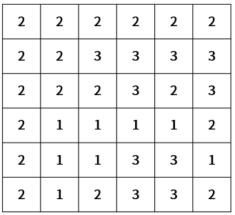
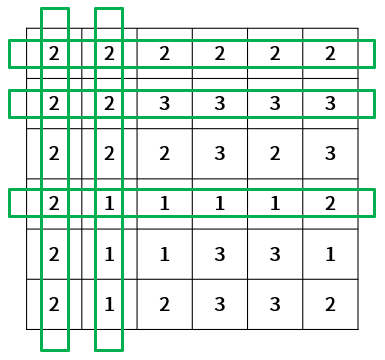

Practice
===

문제 설명
---

주민들의 건강과 행복을 위해 동네에 산책로를 신설하려 한다.  
이 동네의 땅은 평평한 곳도 있고 울퉁 불퉁한 곳도 있는데  
지형의 높이 정보를 2차원 행렬로 나타내보면 다음과 같다.

산책로는 가로 방향 또는 세로 방향으로 직선이 되도록 만들 예정이고,  
기본적으로는 평평한 길에 대해서 신설이 가능하다.  

추가로 울퉁불퉁한 지형에 대해서는 계단을 두는 것을 고려하고 있는데,  
계단의 길이가 2 라면 위의 행렬에서 두 칸을 차지하는 것을 의미한다.  

또한, 계단을 둘 때는 다음과 같은 조건일 때는 설치가 불가능하다.  
* 높은 지형과 낮은 지형의 차이가 1을 초과
* 계단 설치 시, 지형의 범위를 넘어서는 경우
* 계단을 설치하려는 곳이 평평하지 않은 경우
* 계단을 설치한 곳에 또 설치하려는 경우

예를 들어 위의 지형 정보와 계단의 길이를 2 짜리로 설치 시에는,  
다음과 같이 5개에 대한 산책로가 후보로 선택될 수 있다.  

이와 같이 지형 정보와 계단의 길이가 주어졌을 때  
신설 가능한 산책로의 후보 개수를 구하는 프로그램을 작성하세요.

입력 형식
---

지형정보 maps 의 크기는 3 ~ 100 사이의 자연수이다.  
maps 배열 원소로 지형 정보가 주어지며 1 ~ 10 사이의 자연수이다.  
계단 길이 stairLen 은 1 ~ 5 사이의 자연수이다.

출력 형식
---
신설 가능한 산책로의 후보 개수를 반환한다.

입출력 예시
---
| 입력                                                                                                                                                | Stair Length | Result |
|---------------------------------------------------------------------------------------------------------------------------------------------------|--------------|--------|
| {2, 2, 2, 2, 2, 2}   {2, 2, 3, 3, 3, 3}   {2, 2, 2, 3, 2, 3}   {2, 1, 1, 1, 1, 2}   {2, 1, 1, 3, 3, 1}   {2, 1, 2, 3, 3, 2}   | 2            | 5      |
| {2, 2, 2, 2, 2, 2}   {2, 2, 3, 3, 3, 3}   {2, 2, 2, 3, 2, 3}   {2, 1, 1, 1, 1, 2}   {2, 1, 1, 3, 3, 1}   {2, 1, 2, 3, 3, 2}   | 3            | 3      |
