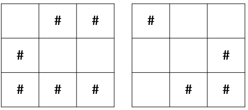
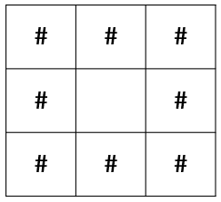

Practice
===

문제 설명
---

보물 지도의 정보로 추정되는 2 장의 메모지를 입수했다.  
며칠간의 연구 끝에 다음과 같은 규칙들을 찾아냈다.  
* 메모지에 적혀있는 숫자들은 지도를 나타내며 두 지도는 모두 n x n 행렬로 나타낼 수 있다.

> 예를 들어 메모지 1 에는 {3, 4, 7}, 메모지 2 에는 {4, 1, 3} 이라고 적혀있을 때,  
> 행렬 데이터로 나타내면 각각 다음과 같다.

* 위의 두 그림을 각각 지도 1, 지도 2라고 할때 아래와 같은 규칙이 있다.
* 지도 1 과 지도 2 두 곳 모두 빈칸인 곳은 빈칸이다.
* 지도 1 과 지도 2 중 어느 하나라도 # 인 곳은 # 이다.

두 지도의 정보를 위의 규칙으로 조합한 결과를 나타내면 다음과 같다.

결과적으로 # 은 보물이 없는 지역, 빈칸은 보물이 있을 가능성이 높은 지역을 나타낸다.

이와 같이 두 메모지가 주어졌을 때 결과 지도를 만드는 프로그램을 작성하세요.

입력 형식
---

지도의 크기 n 에 대한 입력이 주어지며 1 ~ 16 사이의 자연수이다.   
memo1 과 memo2 는 각각 n 만큼의 숫자가 주어지는 배열이다.  
memo1 과 memo2 의 원소는 0 ~ 2^n-1 사이의 자연수이다.

출력 형식
---

두 메모지를 이용하여 해독한 결과 지도를 문자열 배열로 반환하세요.

입출력 예시
---
| n   | memo1                  | memo2               | Result                              |
|-----|------------------------|---------------------|-------------------------------------|
| 3   | {3, 4, 7}              | {4, 1, 3}           | [###, # #, ###]                     |
| 5   | {15, 21, 17, 18, 11}   | {30, 1, 21, 19, 28} | [#####, # # #, # # #, #  ##, #####] |
